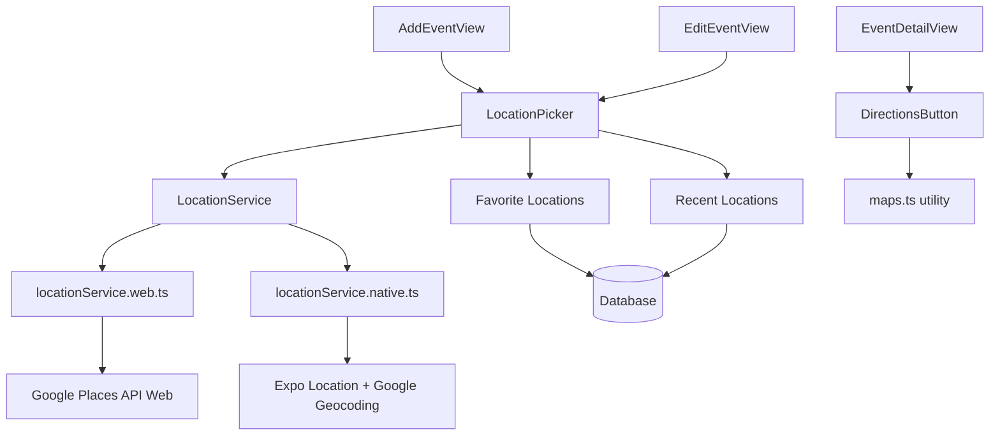
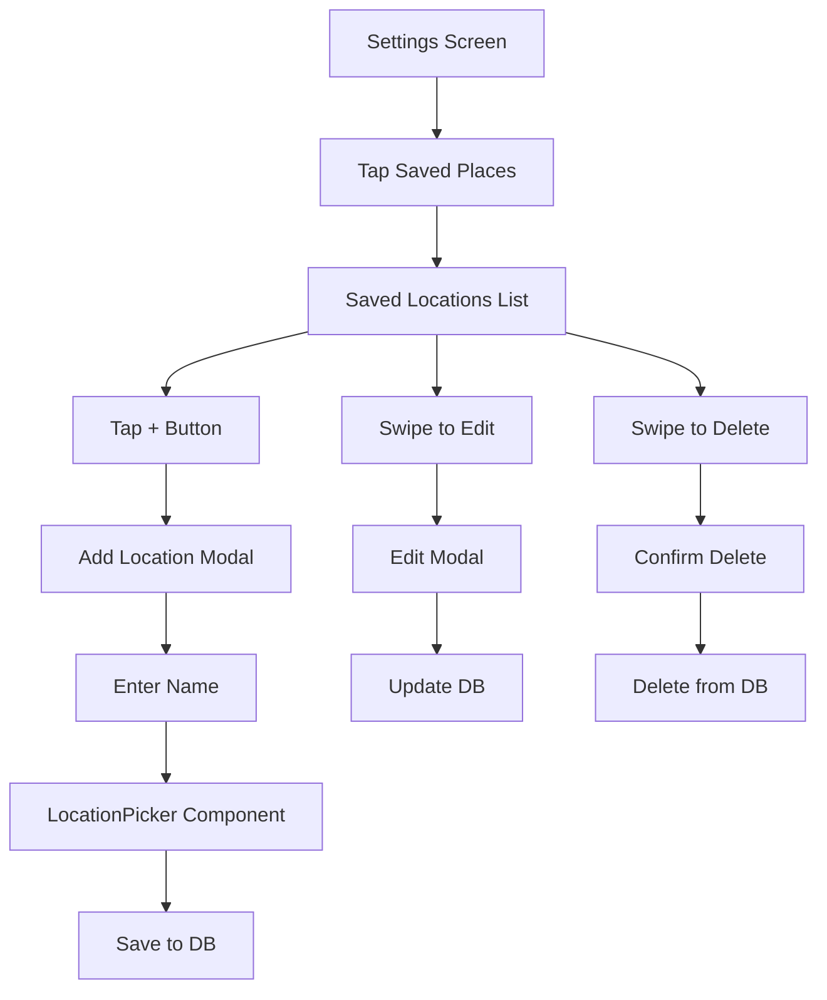

# Location Services Implementation Plan

## Overview

Replace the current simple text location input with a comprehensive location system using Google Maps Platform API. This will provide address autocomplete, reverse geocoding for current location, favorite/recent locations, and directions integration across all platforms.

## Architecture



## 1. Google Maps API Setup & Configuration

**New files:**

- [`lib/googleMapsConfig.ts`](lib/googleMapsConfig.ts) - API key management and configuration

**Steps:**

- Store Google Maps API key in environment variables (`.env`)
- Enable required Google APIs: Places API, Geocoding API, Maps JavaScript API
- Add API key to `app.json` for iOS (under `ios.config.googleMapsApiKey`)
- Add API key to `app.json` for Android (under `android.config.googleMaps.apiKey`)
- For web, load the API dynamically using `@googlemaps/js-api-loader`

## 2. Database Schema Changes

**Migration file:** [`migrations/add_location_features.sql`](migrations/add_location_features.sql)

Add two new tables:

```sql
-- Favorite locations (per family)
CREATE TABLE favorite_locations (
    id UUID PRIMARY KEY DEFAULT uuid_generate_v4(),
    family_id UUID NOT NULL REFERENCES families(id) ON DELETE CASCADE,
    name TEXT NOT NULL,  -- e.g., "Home", "School", "Work"
    address TEXT NOT NULL,
    latitude DOUBLE PRECISION NOT NULL,
    longitude DOUBLE PRECISION NOT NULL,
    place_id TEXT,  -- Google Place ID for future reference
    created_by UUID NOT NULL REFERENCES auth.users(id),
    created_at TIMESTAMP WITH TIME ZONE DEFAULT NOW()
);

-- Recent locations (per family, auto-populated)
CREATE TABLE recent_locations (
    id UUID PRIMARY KEY DEFAULT uuid_generate_v4(),
    family_id UUID NOT NULL REFERENCES families(id) ON DELETE CASCADE,
    address TEXT NOT NULL,
    latitude DOUBLE PRECISION NOT NULL,
    longitude DOUBLE PRECISION NOT NULL,
    place_id TEXT,
    last_used_at TIMESTAMP WITH TIME ZONE DEFAULT NOW(),
    use_count INTEGER DEFAULT 1
);
```

## 3. Location Service Layer

**New service files:**

### [`services/locationService.ts`](services/locationService.ts)

Core types and interface:

```typescript
export interface LocationResult {
  address: string;
  title?: string;
  latitude: number;
  longitude: number;
  placeId?: string;
}

export interface LocationServiceInterface {
  searchLocations(query: string): Promise<LocationResult[]>;
  reverseGeocode(lat: number, lon: number): Promise<LocationResult | null>;
  getCurrentLocation(): Promise<{ latitude: number; longitude: number } | null>;
}
```

### [`services/locationService.web.ts`](services/locationService.web.ts)

Web implementation using Google Places API JavaScript library and Geocoding API

### [`services/locationService.native.ts`](services/locationService.native.ts)

Native implementation using:

- `expo-location` for getting current location
- Google Places API (Geocoding endpoint) via fetch for address search and reverse geocoding

### [`services/favoriteLocationsService.ts`](services/favoriteLocationsService.ts)

CRUD operations for favorite locations table

### [`services/recentLocationsService.ts`](services/recentLocationsService.ts)

Operations to track and retrieve recent locations

## 4. UI Components

### [`components/event/LocationPicker.tsx`](components/event/LocationPicker.tsx)

Main location picker component with:

- Address autocomplete input field
- "Use Current Location" button
- Dropdown/modal showing:
  - Autocomplete results as user types
  - Favorite locations section
  - Recent locations section
- Selected location display with address
- Clear/remove location button

Platform-specific variants:

- **Web**: Dropdown with autocomplete results
- **Native**: Modal bottom sheet with keyboard-avoiding view

### [`components/event/FavoriteLocationItem.tsx`](components/event/FavoriteLocationItem.tsx)

Display and manage favorite locations (add, edit, delete)

### [`components/event/LocationAutocomplete.tsx`](components/event/LocationAutocomplete.tsx)

Autocomplete input with debouncing (300ms) to reduce API calls

## 5. Integration with Event Views

### Update [`components/event/AddEventView.tsx`](components/event/AddEventView.tsx)

- **Remove**: Current simple text input and "Use current" button (lines 52, 261-276, 538-559)
- **Add**: `<LocationPicker>` component
- **Update state**: Replace `location` string with structured location object:
  ```typescript
  const [location, setLocation] = useState<LocationResult | null>(null);
  ```

- **Update createEvent call**: Pass structured location fields to service

### Update [`components/event/EditEventView.tsx`](components/event/EditEventView.tsx)

Same changes as AddEventView

### Update [`components/event/EventDetailView.tsx`](components/event/EventDetailView.tsx)

- Show full address with icon (already done at line 476)
- Update `handleOpenLocation` to use `structured_location_*` fields (already good at lines 122-129)
- Enhance display to show title if available (e.g., "Home" or "Soccer Field")

### Update [`services/eventService.ts`](services/eventService.ts)

Already handles structured location fields well (lines 246-249, 294-297). No major changes needed, just ensure we populate all fields when creating/updating events.

## 6. Saved Locations Settings Screen

### New route: [`app/settings/saved-locations.tsx`](app/settings/saved-locations.tsx)

Full-screen settings page for managing saved locations, accessible from Settings > Saved Places.

**Features:**

- **Header**: Back button, "Saved Places" title, Add (+) button
- **Search bar**: Filter saved locations by name or address
- **Saved locations list**: 
  - Show all favorite locations for the current family
  - Each item displays: location name, address, and icon
  - Swipe actions: Edit, Delete
  - Tap to view on map (optional) or just show details
  - Empty state when no locations saved
- **Add location**: 
  - Opens modal/sheet with LocationPicker
  - User provides a name (e.g., "Home", "Soccer Field", "School")
  - Uses same autocomplete/current location functionality
  - Save to `favorite_locations` table

### New component: [`components/settings/SavedLocationsView.tsx`](components/settings/SavedLocationsView.tsx)

Main view component for the saved locations screen, similar structure to other settings views like `AppSettingsView.tsx`.

**Components breakdown:**

- `SavedLocationItem`: Display individual saved location with edit/delete actions
- `AddLocationModal`: Modal for adding new location with name input + LocationPicker
- `EditLocationModal`: Modal for editing existing location

### Update [`components/settings/SettingsView.tsx`](components/settings/SettingsView.tsx)

Line 155: Add `onPress` handler to navigate to saved locations screen:

```typescript
<SettingsItem 
  icon="location-outline" 
  label="Saved Places" 
  onPress={() => router.push('/settings/saved-locations')}
  iconColor={textColor} 
/>
```

### Update [`app/settings/_layout.tsx`](app/settings/_layout.tsx)

Add the new saved-locations route to the Stack:

```typescript
<Stack.Screen
  name="saved-locations"
  options={{
    headerShown: false,
    presentation: 'modal',
    gestureEnabled: true,
  }}
/>
```

### User Flow



## 7. Dependencies to Install

```bash
# Web-specific
npm install @googlemaps/js-api-loader

# Native-specific (if not already installed)
npx expo install expo-location

# Shared
npm install lodash.debounce @types/lodash.debounce
```

## 8. Environment Configuration

Add to `.env` (and document in README):

```
EXPO_PUBLIC_GOOGLE_MAPS_API_KEY=your_api_key_here
```

Update [`app.json`](app.json):

```json
{
  "expo": {
    "ios": {
      "config": {
        "googleMapsApiKey": "YOUR_API_KEY"
      },
      "infoPlist": {
        "NSLocationWhenInUseUsageDescription": "FamilyCal needs your location to help you add event locations."
      }
    },
    "android": {
      "config": {
        "googleMaps": {
          "apiKey": "YOUR_API_KEY"
        }
      },
      "permissions": ["ACCESS_COARSE_LOCATION", "ACCESS_FINE_LOCATION"]
    }
  }
}
```

## 9. Implementation Order

1. **Setup (API keys, dependencies)**
2. **Database migration** - add favorite_locations and recent_locations tables
3. **Core location service** - locationService.ts interface
4. **Platform implementations** - web and native location services
5. **Favorite/Recent services** - database operations
6. **LocationPicker component** - main UI component
7. **Integration with events** - update AddEventView, EditEventView
8. **Saved Locations settings screen** - full management UI in settings
9. **Polish** - add to EventDetailView, test on all platforms

## Key Technical Decisions

- **Why Google Maps Platform?** Comprehensive, well-documented, consistent across platforms, you chose it
- **Why separate web/native implementations?** Web uses JS API loader, native uses expo-location + REST API for better performance
- **Debouncing autocomplete:** 300ms delay to minimize API costs
- **Recent locations:** Auto-track last 10 locations per family, ordered by frequency and recency
- **Favorite locations:** Manual user management, stored per family (not per user) so whole family benefits
- **Security:** API key restricted by platform (iOS bundle ID, Android package, HTTP referrers for web)

## Testing Checklist

### Location Picker (Event Creation)

- [ ] Address autocomplete works on web
- [ ] Address autocomplete works on iOS
- [ ] Address autocomplete works on Android  
- [ ] "Use Current Location" works and shows full address
- [ ] Recent locations appear and are clickable in picker
- [ ] Favorite locations appear and are clickable in picker
- [ ] Events save with full address and coordinates
- [ ] Event detail shows location with "Get Directions" button
- [ ] Maps app opens with correct location
- [ ] API calls are debounced properly (check network tab)

### Saved Locations Settings Screen

- [ ] Can navigate to Saved Places from Settings
- [ ] Empty state shows when no locations saved
- [ ] Can add new location with name and address
- [ ] Can edit existing saved location
- [ ] Can delete saved location (with confirmation)
- [ ] Search/filter works for finding locations
- [ ] Saved locations sync across family members
- [ ] Swipe actions work on native platforms
- [ ] Adding location from settings makes it available in event picker

### Error Handling

- [ ] Works offline gracefully (shows error, doesn't crash)
- [ ] Handles GPS permission denied gracefully
- [ ] Shows error when Google API quota exceeded
- [ ] Shows error for invalid addresses